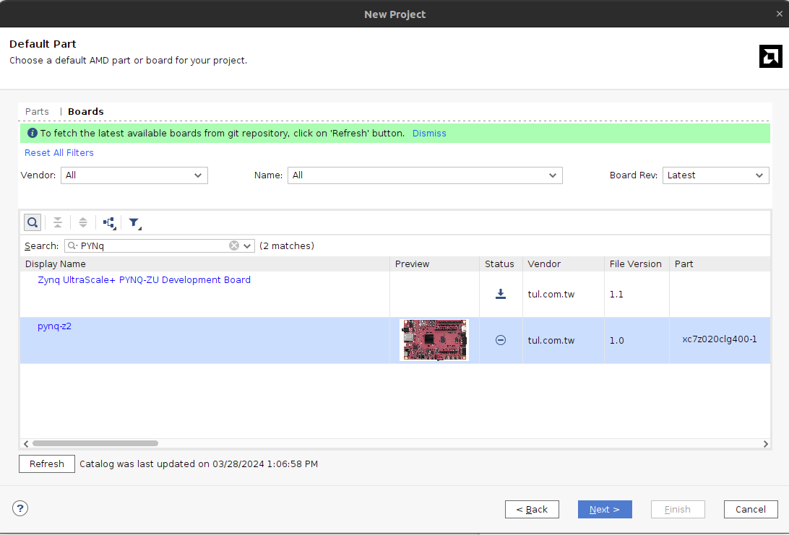

# Instalación

Vamos a trabajar con la placa [PYNQ-Z2](https://www.tulembedded.com/FPGA/ProductsPYNQ-Z2.html).

Se usa la versión de Vivado 2023.2. Se debe instalar la versión completa, con **Vitis** y **Model Composer**.

La versión de MATLAB no es muy relevante. Durante este tutorial se usa Matlab R2022b en Linux. Se deben instalar, aparte de la versión base, los siguientes add-ons:

* Communications Toolbox.
* Filter Design HDL Coder.
* Fixed-Point Designer.
* HDL Coder.
* HDL Verifier.
* Matlab C Coder.
* Simulink.
* System Composer.
* DSP Toolbox.

## Agregar la PYNQ a Vivado (Automático)

Durante la creación de un proyecto nuevo, en la pestaña de selección de placa, al apretar el botón de "Refresh" el Vivado actualiza su listado de placas desde GitHub, y encuentra para descargar la PYNQ-Z2.



## Agregar la PYNQ a Vivado (Manual)

1. Descomprimir los archivos de la placa (`PYNQ/pynq-z2.zip`).

2. Copiar la carpeta generada (de nombre `pynq-z2`) en el directorio de Vivado `Xilinx/Vivado/2023.2/data/boards/board_files`. Puede ser necesario generar la carpeta "board_files".

3. Reiniciar el Vivado, y ya debería aparecer para seleccionar la placa al crear un nuevo proyecto.


## Instalación de Cable Drivers

Estos permiten reconocer a la PYNQ como un dispositivo en la computadora a la hora de hacer un "printf" por puerto serie. En Linux:

```bash
cd ${vivado_install_dir}/data/xicom/cable_drivers/lin64/install_script/
install_drivers/

sudo ./install_drivers
```

## Documentación

Dentro de la carpeta PYNQ se encuentran datasheets y archivos relacionados con la placa PYNQ a los que se hará referencia en futuros tutoriales.
