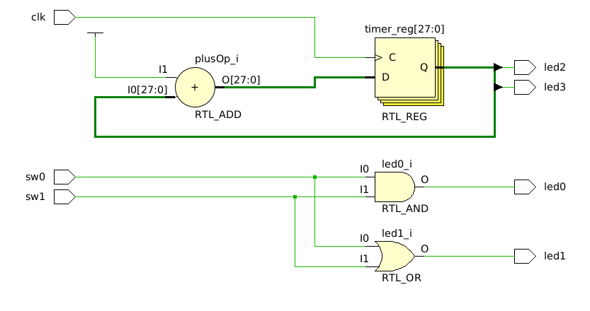

# VHDL Puro

En este tutorial se crea un proyecto de Vivado que contiene solamente archivos HDL, cuya función es la de prender y apagar los LEDS de la PYNQ-Z2.

## Creación del módulo

Creamos nuestro módulo con las siguientes entradas y salidas.

El código de VHDL utiliza lógica combinacional para prender los LEDS en función del estado de los switches; y en el process una señal de clock para prender el LED en función del valor de un contador.

El RTL generado se muestra en el siguiente gráfico.

## Asociación de pines

Ahora vamos a crear un archivo de *Constraints*. En el Vivado, apretamos "Add Sources", y seleccionamos "Add or create constraints". Ahí vamos a buscar el archivo `.xdc` que nos da el fabricante de la PYNQ (se encuentra en la sección de instalación).

Una vez incorporado en nuestro proyecto, descomentamos los pines que vamos a usar y cambiamos los nombres de los puertos para que coincidan con los nombres que usamos en el módulo (es decir, "clk", "sw0", "sw1", "led0", etc).

En la siguiente tabla, podemos apreciar que la documentación de la PYNQ se condice con los pines que estamos conectando. Es decir, el `PACKAGE_PIN R14`, uno de los pines del IOB (I/O Block) que conectan la PL (Programmable Logic) con el exterior, está conectado a un LED.

E incluso podemos ver el PIN conectado desde el esquemático:

## Creando Bitmap y flasheando código a la FPGA

Le damos a generar Bitstream (lo cual va a generar por defecto el RTL, la síntesis y la implementación todo junto). Luego vamos a `Flow->Open Hardware Manager`, y le damos a `Open Target`, y luego a `Program Device`, en la franja verde en la parte superior de la pantalla.

El código corriendo en la FPGA se muestra en el siguiente GIF:

<video src="images/example_running.mp4" controls title="FPGA running example"></video>