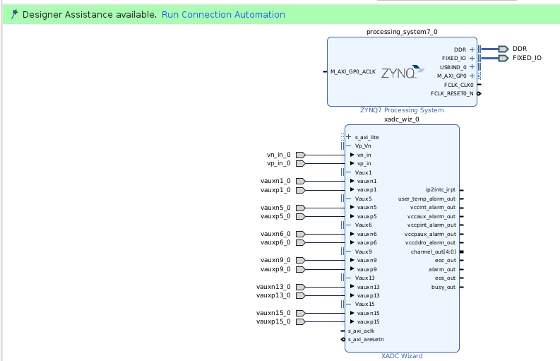

# IP Integrator

En este tutorial vamos a instanciar el IP Core del XADC, el cual se encuentra dentro del PS (Programmable Software); intercomunicarlo por interfaz AXI4-Lite con la PL (Programmable Logic) y leerlo desde un código de C corriendo sobre el Cortex-A los datos del ADC.

## Pinout del XADC (y de la FPGA en general)

Lo primero que tenemos que averiguar es a qué pines está conectado el XADC.

La PYNQ-Z2 utiliza la FPGA **ZYNQ XC7Z020-1CLG400C**. Lo primero que hacemos es ir al [Zynq-7000 SoC Packaging and Pinout Product Specification UG865](https://docs.amd.com/v/u/en-US/ug865-Zynq-7000-Pkg-Pinout), en donde encontramos el pinout:

¿Cómo leer el siguiente gráfico?

Cada pin tiene asociado un número y una letra. Por ejemplo, el pin *C20* es un círculo negro, que si vemos en la tabla de abajo corresponde con uno de los pines del ADC (ADxP/ADxN hace referencia a la entrada "P" positiva o "N" negativa del ADC, con "x" entre 0 y 15).

Además, por ser un círculo, este pin empieza con la nomenclatura "IO_LXXY_#", la cual se explica en el UG865.

Si bien el gráfico es una ayuda visual, el listado completo de pines se puede descargar desde el archivo UG865 como un documento txt (el cual se encuentra en la carpeta de instalación bajo el nombre `PYNQ/xc7z020clg400pkg.txt`).

Ahora, si vamos al manual de la PYNQ, obtenemos los pines a los que están asociados los 6 posibles canales del XADC, conectados a los pines físicos de la placa de desarrollo A0-A5.

(Nota: por cómo está conectada la placa, con el divisor resistivo de 2.32K y 1K, en realidad los pines de la tabla hacen referencia a la entrada "Digital IO", y no la del ADC "Adx_P / ADx_N).

Del circuito anterior y del esquemático de la PYNQ, podemos deducir que todos los pines ADx_N están conectados externamente a GND, y que los positivos están conectados como sigue:

* E17 -> A0 -> AD1P  (vauxp1)
* E18 -> A1 -> AD9P  (vauxp9)
* K14 -> A2 -> AD6P  (vauxp6)
* K16 -> A3 -> AD15P (vauxp15)
* J20 -> A4 -> AD5P  (vauxp5)
* G20 -> A5 -> AD13P (vauxp13)

## Usando el IP integrator

Agregamos el archivo de constraints como hicimos en (01), y apretamos "Create Block Design".

Como queremos conectar el procesador con el ADC, primero agregamos el bloque de PS de la ZYNQ.

Notar la aparición de la franja verde con *Run Block Automation*. El Vivado puede reconocer de forma automática como se conectan algunas cosas (sobre todo las conexiones AXI), y usaremos ese botón bastante seguido.

Al apretarlo, nos sugiere conectar como pines externos las conexiones en "DDR" y "FIXED_IO". Esto es lógico, ya que dentro de estos buses se encuentran los **MIO** (Multiplexed I/O, que incluyen las conexiones de UART, SPI, i2C, Ethernet, USB, etc), y las conexiones para acceder a la memoria del procesador.

Ahora, instanciamos el XADC con los siguientes parámetros:

* Interfaz AXI4Lite: Es una interfaz AXI4, y el "Lite" hace referencia a que solamente transmite de a un dato por vez.
* Channel Sequencer: Leer varios canales del ADC.
* Todas las alarmas desactivadas.
* Channel Averaging de 16 muestras (mostrara como resultado el promedio de las últimas 16 mediciones).
* Los canales a activar se corresponden con aquellos que tienen los pines ruteados en la PYNQ. Habilitamos el canal y el average.

Luego, hay que asegurarse de marcar los pines como externos, y el resultado se muestra en la siguiente figura.

Ahora aparece en verde el *Run Connection Automation*, el cual detecta que nuestro procesador tiene un bus M_AXI_GP0 (Master AXI4 General Purpose), y el XADC tiene un *s_axi_lite* (Slave AXI4 Lite). Es decir, detecta la conexión maestro-esclavo AXI y une ambas interfaces. La siguiente imagen muestra el resultado de la conexión, donde vemos que Vivado agregó de forma automática la interconexión AXI, y un mecanismo de reset.

Finalmente, es importante recordar descomentar en el archivo de constraints los pines a usar, poniendo como nombre del port el mismo que aparece en el IP Integrator.

## Generar HDL y Bitstream a partir del diagrama de bloques

Click derecho en el archivo de diseño, *Create HDL Wrapper*.

Luego, en el Flow Navigator, *Generate Block Design*.

Después, generamos el Bitstream.

Con el Bitstream generado, vamos a *File->Export->Export Hardware*, y generamos el archivo ".xsa", asegurando de incluir el bitstream.

Ya terminamos con el Vivado. Ahora podemos iniciar el Vitis con *Tools->Launch Vitis IDE*.

## Vitis IDE

El Vitis es el IDE que permite codear en C sobre el Cortex-A que hay en la Zynq.

### Crear proyecto

Al abrir el Vitis, lo primero es setear el Workspace: con cualquier directorio vale.

Después tenemos que indicarle al VITIS cuál es nuestra **platform**, es decir que FPGA estamos usando, y qué recursos tiene conectados; los cuales quedaron definidos en el archivo ".xsa" generado desde Vivado.

Vamos a "File->New Component->Platform". Luego, seleccionamos nuestro hardware desing (archivo XSA), el procesador y el sistema operativo sobre el que va a correr (de momento, el OS será standalone, que equivale a una aplicación en bare metal).

Luego de creada la plataforma, ahora vamos a crear una aplicación.

Vamos a "File->New Component->Application", seleccionamos nuestra plataforma de hardware y le damos a aceptar. Terminado este paso, ya tenemos una carpeta "Sources/src" donde podemos escribir nuestro código de C para bootear en el procesador de la FPGA. Si curioseas un poco, vas a poder encontrar el CMakeLists.txt y el Linker script.

### Leyendo datos del XADC

Nuestro objetivo es encontrar donde están mapeados en memoria los registros del XADC, leer y escribir esa ubicación, y presentar de alguna forma los datos para saber que funcionan correctamente.

Si vamos a la documentación del IP Core XADC Wizard 3.0, encontramos los registros del ADC:

Donde el valor de **C_BASEADDR** se puede encontrar desde el Vivado, en el Address Editor ("Window->Address Editor"). Para el caso de la imagen siguiente, *C_BASEADDR = 0x43C00000*.

En el manual del XADC (UG480), encontramos que la información está en los 12 bits MSB del registro de 16bit, y que el valor del LSB del ADC es de 244uV. Además, recuerde que la PYNQ usa un divisor resistivo para bajar la tensión de 3.3V a la entrada del ADC a 1V, por lo que el valor leído debe ser multiplicado por *3.32*.

### Visualización por puerto serie

Flasheamos el código en la FPGA, y nos conectamos por puerto serie a la placa. Se comprobó que los valores medidos por el multímetro y los publicados por el puerto serie cambiaban y se correspondían para los puertos A0-A5 de la placa.

