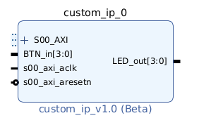
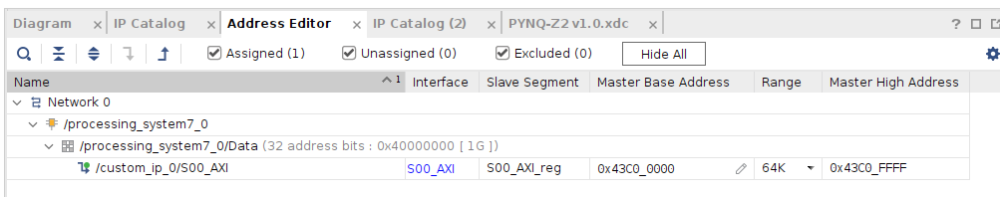
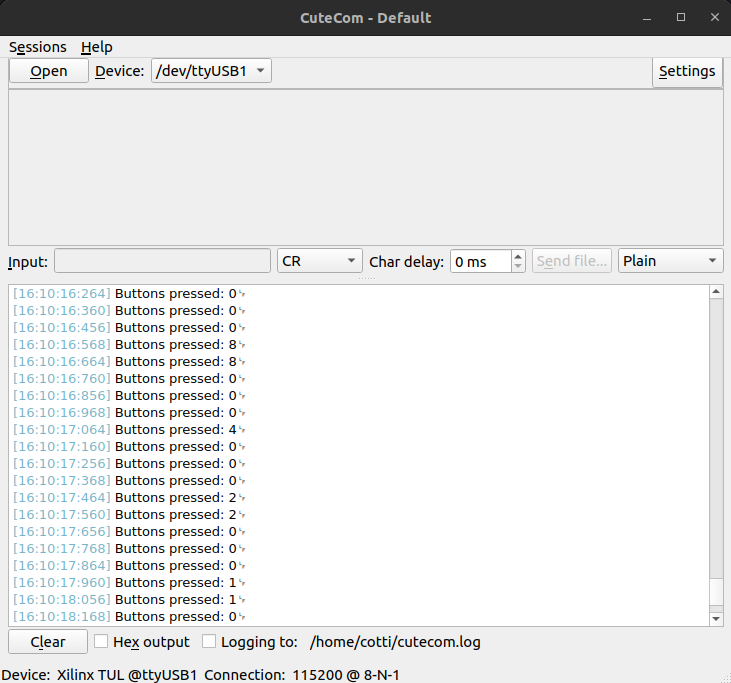

# Creating custom IP

En este ejercicio vams a crear nuestro porpio IP Core e integrarlo con el software programable (PS) de la ZYNQ mediante una interfaz AXI4. El propósito de este IP Core será manejar los LEDS y los botones de la placa.

## Primeros pasos

Una vez creado un nuevo proyecto, y creado un nuevo "Block Design", vamos a "Tools->Create and Package New IP...".

Seleccionamos la opción "Create AXI4 Peripheral". Luego, toca configurar la conexión AXI4. Podemos ponerle el nombre, el tipo (Lite, Full, Stream), si es maestro o esclavo, el tamaño del bus de bits, y la cantidad de registros que tendrá este periférico.

Vamos a configurarlo como Lite, esclavo, de 32bits, y con 4 registros. Es "Lite" porque solamente vamos a estar escribiendo o leyendo de a un registro a la vez. Es esclavo porque solamente nos vamos a comunicar desde el procesador para prender los LEDS. Es de 32 bits porque es un tamaño estándar del bus. Tiene cuatro registros porque es el mínimo, pero en realidad necesitamos solo 2: uno para almacenar los estados de los LEDS, y otro para almacenar los estados de los switches.

Le damos a terminar con "Edit IP". Esto debería abrir un nuevo proyecto.

Ahora, vamos a modificar la IP creada, para que tenga algún uso.

## Modificación de la IP creada

Dentro del proyecto de la IP se generan dos archivos VHDL: uno top level (arch_imp), y uno dentro de este que es la instanciación. Ambos archivos funcionan como templates para definir nuestra lógica propia.

Las modificaciones en el archivo aparecen comentadas con "--Cotti". En el archivo bottom level:

* Agregamos nuestros ports de entrada y salida: 4 leds y 4 botones en la PYNQ.
* Definimos las señales a ser usadas. Hay una sección titulada "signals for user logic register space example", en donde aparecen los registros que pueden ser escritos y leidos por la interfaz AXI4. Para este ejemplo, agregamos una signal con el estado de los botones.
* Abajo de todo, conectamos la salida de los leds al registro "0", y la entrada de los botones a la signal, que luego conectamos al registro 1.

El código modificado se ve como sigue:

```hdl
-- Users to add ports here
LED_out : out std_logic_vector (3 downto 0);
BTN_in : in std_logic_vector (3 downto 0);
-- User ports ends

------------------------------------------------
---- Signals for user logic register space example
--------------------------------------------------
---- Number of Slave Registers 4
signal slv_reg0	:std_logic_vector(C_S_AXI_DATA_WIDTH-1 downto 0);
signal slv_reg1	:std_logic_vector(C_S_AXI_DATA_WIDTH-1 downto 0);
signal slv_reg2	:std_logic_vector(C_S_AXI_DATA_WIDTH-1 downto 0);
signal slv_reg3	:std_logic_vector(C_S_AXI_DATA_WIDTH-1 downto 0);
signal slv_reg_rden	: std_logic;
signal slv_reg_wren	: std_logic;
signal reg_data_out	:std_logic_vector(C_S_AXI_DATA_WIDTH-1 downto 0);
signal byte_index	: integer;
signal aw_en	: std_logic;

signal BTN_out :std_logic_vector(C_S_AXI_DATA_WIDTH-1 downto 0); --Cotti


-- Address decoding for reading registers
loc_addr := axi_araddr(ADDR_LSB + OPT_MEM_ADDR_BITS downto ADDR_LSB);
case loc_addr is
    when b"00" =>
    reg_data_out <= slv_reg0;
    when b"01" =>
    reg_data_out <= BTN_out;   --Cotti
    when b"10" =>
    reg_data_out <= slv_reg2;
    when b"11" =>
    reg_data_out <= slv_reg3;
    when others =>
    reg_data_out  <= (others => '0');
end case;

-- Add user logic here
LED_out <= slv_reg0(3 downto 0);    --Cotti
BTN_out(3 downto 0) <= BTN_in;     -- Cotti
-- User logic ends
```

En el archivo top level, tenemos que copiar y pegar los port que agregamos en tres lugares: en la declaración de la entity, en la declaración del componente, y en el port map de la instanciación.

Finalmente, en "Package IP" nos aseguramos que todos los "Packaging Steps" tengan tildes verdes (quizá sea necesario apretar "Merge Changes"). Le damos a Re-Package IP y cerramos el proyecto del editor de IP.

## Conectando la IP creada

Si hicimos todo bien, al querer agregar la Io en el Block Designer, deberían aparece nuestros ports:



Para conectar este bloque con la ZYNQ, definimos los puertos de los leds y los botones como externos, agregamos el bloque de la ZYNQ, y ejecutamos el "Run Block Automation" y "Run Connection Automation".

Luego, tenemos que mapear los pines físicos con los LEDS y los botones. Importamos el archivo de constraints la placa ".xdc", descomentamos los leds y botones, y nos aseguramos que los puertos tengan el mismo nombre que en el Block Design (`LED_out[x]` y `BTN_in[x]` según la figura anterior).

Finalizamos con "Generate HDL Wrapper", "Generate Block Design" y "Generate Bitstream". Después, "File->Export->Export Hardware", incluyendo el Bitstream para generar el archivo XSA.

## Código en Vitis

Abrimos el Vitis, y hacemos el mismo procedimiento que en el ejemplo (02). Creamos el Platform Component con el archivo XSA. Luego, creamos un Application Component, con el "main.c", y buscamos desde el proyecto de Vivado, la dirección de memoria a donde están mapeados los registros de nuestro IP Block que creamos, en este ejemplo es 0x43C0_0000.



Para poder interactuar con nuestra IP creada, tenemos que importar los drivers ".c" y ".h". Esos archivos se pueden encontrar en `${IP_project}/drivers/src/*``.

En la siguientes imágenes, podemos ver la lectura del registro al apretar los botones, y la escritura del registro al usar los leds como contadores



<video src="images/03_counter_video.mp4" controls title="FPGA running example"></video>

**Nota:** Si aparece un error relacionado con "ps7_init", buscar en la aplicación "Settings/launch.json", y cambiar el archivo de inicialización por "ps7_init.tcl".
