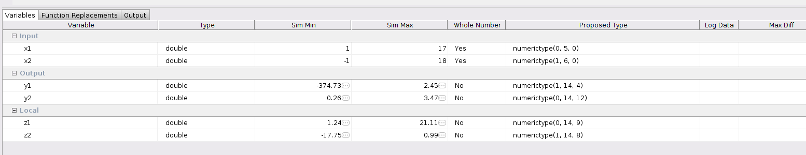
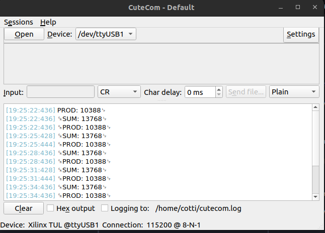

# HDL Coder

En este ejercicio vamos a crear un archivo VHDL a partir de una función de Matlab, generar un IP Core customizado, y luego usar el Ip Core desde Vitis en C.

## HDL Coder en MATLAB

Creamos una función con entradas y salidas en Matlab. Es posible usar variables intermedias.

Luego, creamos otro archivo que sea el "testbench". En él, invocamos a la función con varios argumentos posibles, lo que ayudará al Matlab a definir el tipo de los argumentos de entrada y de salida (números negativos, positivos, con decimales, tamaño, etc).

Vamos a "Apps->HDL Coder" y agregamos la función de Matlab y el testbench. Luego, apretamos el "Workflow Advisor".

El Workflow advisor te guía por los distintos pasos de la creación del HDL:

1. Define Input Types: Apretar el "Run" hace que Matlab infiera el tipo de la entrada, en función del testbench.

2. Fixed Point Conversion: Convierte los tipos "double" a punto fijo. Apretamos "Analyze", y aparecerá para que definamos por cada variable intermedia, entrada y salida si son signados, cuántos bits en total tienen y cuántos bits de la parte decimal. Una vez definido, le damos a "Validate Types".

    

3. Select Code Generation Target: Se define si se genera código HDL genérico (se usa esta opción), o un IP core.

4. HDL Code Generation: Se define si usar VHDL / Verilog y el coding style, así como los puertos para el clock, el reset, etc. Luego de este paso, ya está generado el VHDL con nuestro código.

## Vivado

Con el código que obtuvimos de Matlab, vamos a repetir los pasos del ejercicio (03) para crear nuestro propio IP Block con interfaz AXI4. Los pasos resumidos son:

1. Create Block Design

2. "Tools->Create and Package New Ip...". Create AXI4 Peripheral. Edit IP.

3. Dentro del proyecto del IP Block (modificaciones comentadas con `--Cotti`):
    * Agregamos el código VHDl del Matlab como un nuevo source.
    * Agregamos la "entity" del código de Matlab como un "component" dentro de la "architecture" del archivo bottom layer del IP.
    * Creamos señales para rutear las señales de salida a registros.
    * Instanciamos el componente con el "PORT MAP" dentro de la lógica de usuario, donde las entradas serán los registros, y las salidas las señales auxiliares.
    * Asociamos las señales a los registros de salida.
    * Un poquito más arriba, reemplazamos la asociación del registro de salida por el valor de la señal.

4. En "Package IP" nos aseguramos de que todo esté en orden y generamos el bloque.

5. De vuelta en el Block Design del proyecto, agregamos los bloques del nuevo IP generado, y del procesador ZYNQ. Ejecutamos "Run Block Automation" y "Run Connection Automation".

6. Create HDL Wrapper.

7. Generate Block Design.

8. Generate Bitstream.

9. "File->Export->Export->Export Hardware", asegurando de incluir el bitstream, y vamos al Vitis.

## Vitis

1. Creamos el Platform Component a partir del archivo XSA.

2. Creamos el Application Component usando la plataforma del paso anterior.

3. Importamos los drivers del IP Core creado por nosotros, que se encuentran en su carpeta drivers.

4. Creamos el archivo "main.c", buscamos el Base address en el block design de Vivado, y ya podemos leer y escribir los registros.

## Resultado

**Nota:** Si aparece un error relacionado con "ps7_init", buscar en la aplicación "Settings/launch.json", y cambiar el archivo de inicialización por "ps7_init.tcl".
