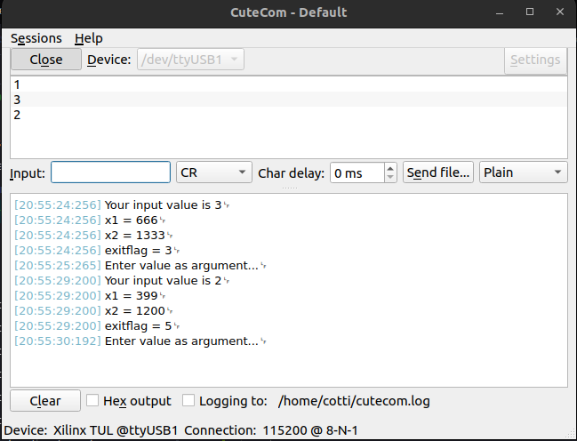

# Matlab C coder

En este ejercicio vamos a generar un código de C a partir de una función de Matlab, y embeberla en la FPGA.

## Matlab C Coder

Creamos nuestra función de Matlab. No todas las funciones de Matlab son traducibles a C, y se debe verificar que las funciones usadas digan que explícitamente soportan "C/C++ Code Generation". Un ejemplo de esto es la función usada [mpcActiveSetSolver](https://uk.mathworks.com/help/mpc/ref/mpcactivesetsolver.html).

Abrimos el MATLAB Coder y seguimos los pasos de instalación. Cuando lleguemos a la parte de "Generate Code" es importante seleccionar el hardware para el cuál vamos a generar el código de C. (en este ejemplo, se usa ARM Compatible - ARM Cortex-A).

Terminado el instalador, ya tenemos todos los archivos "c" y "h" que necesitamos.

## Vitis

Para este ejercicio, se usa el mismo archivo XSA del ejemplo anterior.

El flujo de creación del proyecto es el mismo. Lo que vamos a hacer es importar todos los archivos ".c" y ".h" que se encuentren dentro de la carpeta `${matlab_project}/codegen/c_function/lib`, y también el "main.c" de ejemplo en `examples`. La compilación debería resultar sin errores, aunque puede fallar el linkeo (hay que agregar la librería "m" para math de C en las opciones de linkeo).

Y listo, ya tenemos el proyecto compilado y listo para funcionar. El resultado de la ejecución se muestra a continuación.

