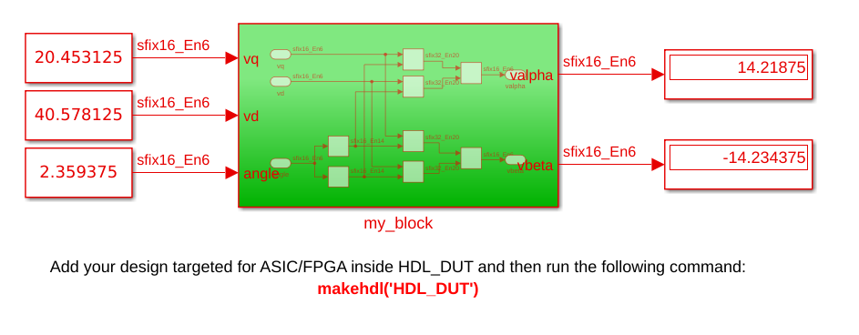

# Simulink Coder

En este ejercicio vamos a crear un diagrama en bloques en Simulink, para luego generar un IP Core propio con interfaz AXI y usarlo desde el procesador Cortex-A con código en C en Vitis.

Además, dentro del proyecto de Matlab, se adjunta un script con teoría de cómo interpretar los números de punto fijo llamado `matlab/fixed_point_explained.m`.

## Simulink

Al crear un nuevo proyecto de Simulink, buscaremos "HDL Coder" y usaremos el proyecto "Blank DUT".

Dentro del "bloque verde", es donde armaremos nuestro diagrama de Simulink. En él, **solamente podemos usar los bloques de la librería "HDL Coder". La parte de afuera define las entradas y salidas, más instrumentos de medición para verificar el correcto funcionamiento del DUT (Device Under Test), la cual puede usar cualquier bloque.

Desde el Simulink es posible definir en los bloques de sumatoria, multiplicación, constante, etc; el tipo de dato. Se recomienda definir solamente los tipos de datos de entrada y de salida, y dejar que Simulink infiera los tipos de datos intermedios necesarios durante las operaciones.

## Generación del HDL

Vamos a HDL Code, y apretamos "HDL Code Advisor", y "Run Selected Checks". Esto genera una serie de warnings para optimizar la lógica del HDL generado.

Luego, vamos a "Workflow Advisor" y apretamos "Run All". Esto genera el RTL, no el HDL. Cerramos la pestaña, y ahora tenemos dos opciones:

Si la damos directamente a "Generate HDL Code", se empezará a ejecutar el script desde la Command Window de Matlab, y tendremos el VHDL. Sin embargo, el entity generado tiene otras señales, además de las definidas de entrada, como "clk", "reset", "clk_enable", etc.

Para evitar que aparezcan señales que no definimos y simplificar la generación, vamos a "Settings->HDL Code Generation->Global Settings" y hacemos lo siguiente:

* En Ports, marcamos "Minimize clock enables" y "Minimize global resets".

Al marcar esas opciones, el único port extra es el de "clk", el cual es necesario para muestrear las entradas.

## Vivado

Ya con el código VHDL, creamos un nuevo proyecto en Vivado y repetimos el procedimiento para crear un nuevo IP, pero con el código generado por Matlab:

1. Generate Block Design

2. Tools->Create and Package New IP

3. En el proyecto del IP, copiamos los HDL generados por Matlab.

4. Agregamos la Entity como un component en el architecture del archivo bottom layer AXI, e instanciamos en la lógica.

5. Creamos señales para las salidas, ruteamos los registros a las salidas, y modificamos arriba de la lógica para devolver las signals cuando se pidan los registros.

6. Re-Package IP.

7. En el proyecto general, agregamos el bloque ZYNQ y la IP nuestra, conectamos todo, Generate HDL Wrapper, Generate Block Design, Generate Bitstream. Export Hardware.

## Vitis

1. Creamos la plataforma con el archivo XSA.

2. Creamos la aplicación.

3. Importamos los drivers del IP block que creamos, y creamos el main.

El resultado se ve en las siguientes imágenes, y vemos que el valor de Simulink se condice con el valor de la FPGA. Notar que en la FPGA, se escriben en los registros la representación entera del valor fraccionario, la cual se obtiene en este caso al multiplicar el número por $2^6$.

