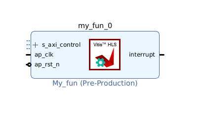
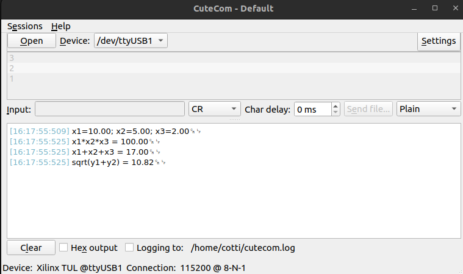

# Vivado HLS (High Level Synthesis)

En este ejercicio vamos a convertir un código de C en HDL desde el Vitis, usando el HLS. Al final de este documento, haremos una comparación de usar el HLS para generar IP blocks, en vez de crearlos nosotros directamente con el VHDL devuelto por Matlab.

## Generación del código de C

Para hacer el ejercicio genérico, el código de C se obtiene desde el Matlab C Coder. Se escribe la función en Matlab, y luego se convierte a C.

## Vitis HLS

Creamos un nuevo componente "HLS". Importamos los archivos ".c" y ".h" del código en C generado. Indicamos la función top level. Agregamos como testbench el "main.c" de ejemplo que genera el Matlab. Dejamos las configuraciones por defecto.

Una vez agregado todo, en la parte inferior izquierda del IDE aparece el "Flow" del proyecto. Verificamos de poder correr el primer paso "C Simulation->Run".

Como queremos que nuestro código se convierta en un IP con interfaz AXI, tenemos que hacer algunos cambios:

* Cambiar los tipos de variables double por float (ya que el bus AXI es de 32 bits).

* En el explorador del proyecto, vamos a "Settings->Design Directives->Interface->Interface->Add Item". Se abre un menú a la derecha, apretamos en el signo más de "Add directive", y seleccionamos "INTERFACE" y "Source File", y de modo "s_axilite". Repetimos por cada entrada y salida, para que puedan ser accedidas por AXI.

Le damos a "C SYNTHESIS" y nos genera un reporte de las interfaces AXI, y los recursos usados de la FPGA para ejecutar este código.

Le damos a "C/RTL COSIMULATION", y luego a "PACKAGE" e "IMPLEMENTATION". Terminados este paso, ya deberíamos tener el IP propio generado a partir del código de C.

## Vivado

Creamos un proyecto, iniciamos el Block Design, y tenemos que agregar en settings el repositorio del IP que acabamos de generar (el cual se corresponde con la carpeta del proyecto de Vitis donde se haya generado el IP).

Luego, el procedimiento es estándar para conectar con el procesador de la ZYNQ, y exportar el XSA para codear en el procesador en C.

## Vitis: Application project

Creamos el platform con el XSA, el Application Component, e importamos los drivers del IP que creamos nosotros. Notamos que los archivos de drivers están populados con muchas funciones para acceder a interrupciones, saber si una operación está en progreso o lista, etc; mientras que los IP cores generados con VHDL puro tenían la carpeta de drivers vacía.

El resultado se muestra en la siguiente imagen

## Conclusión Vitis HLS vs Matlab HDL Coder

La única diferencia entre ambos métodos desde un punto de vista de implementación es la facilidad de no tener que pasar por el generador de IP, pues el package de la IP lo genera el HLS, y la posibilidad de usar las funciones de los drivers que genera de forma automática.

Desde mi punto de vista, si tu código ya está en Matlab no tiene sentido pasarlo a C para luego pasarlo a VHDL por el Vitis, cuando lo podés pasar directo desde Matlab a HDL. En cambio, si tu código estaba en C previamente, ahí sí tiene sentido usar el Vitis si resulta necesario pasarlo a VHDL.
