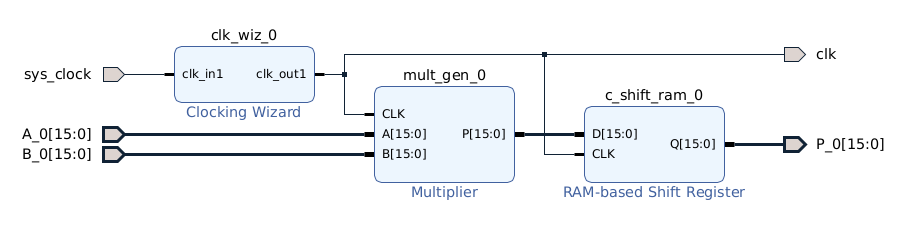
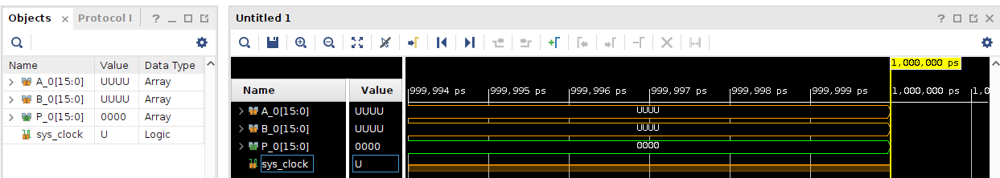
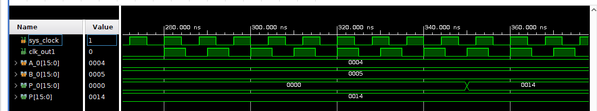
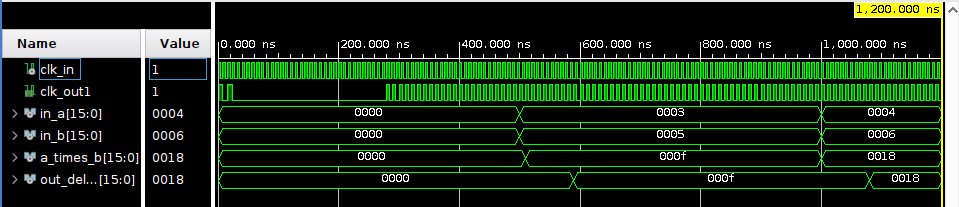
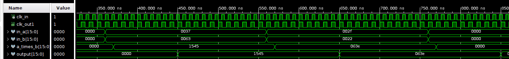

# Block design debugging

En este tutorial vamos a ver cómo verificar el comportamiento de un block design usando testbenches en Vivado.

## Multiplicador con delay

En el siguiente diseño, se instanció un multiplicador, y un delay de 8 muestras, usando un clock de 100MHz. El objetivo es verificar el correcto funcionamiento, usando un testbench.



### Método con constantes

1. Ir a "Sources". Crear HDL Wrapper del Block Design.

2. Corremos "Simulation -> Run Simulation -> Run Behavioral Simulation". Se debería abrir la ventana del analizador lógico de Vivado, pero las dos entradas y el clock no están definidos.



3. Busco la señal de la salida del multiplicador, y la agrego al analizador lógico.

4. Click derecho en la señal "sys_clock -> force clock", y seteamos un clock de 8ns (125MHz).

5. Click derecho en las señales de entrada y seteamos valores constantes "Force constant".

El resultado final se condice con lo esperado:

* Clock de entrada de 8ns (125MHz).
* Clock de salida de 10ns (100MHz).
* Delay de 8 ciclos entre la multiplicación y el resultado de la salida (4*5 = 0x14 = 20).



### Método con testbench

Usar solamente constantes a mano no es práctico. Se quiere crear un testbench donde las señales de entrada y de salida queden bien definidas.

El código del componente generado por el HDL Wrapper es:

```vhd
library IEEE;
use IEEE.STD_LOGIC_1164.ALL;
library UNISIM;
use UNISIM.VCOMPONENTS.ALL;
entity multipliers_wrapper is
  port (
    A_0 : in STD_LOGIC_VECTOR ( 15 downto 0 );
    B_0 : in STD_LOGIC_VECTOR ( 15 downto 0 );
    P_0 : out STD_LOGIC_VECTOR ( 15 downto 0 );
    clk : out STD_LOGIC;
    sys_clock : in STD_LOGIC
  );
end multipliers_wrapper;

architecture STRUCTURE of multipliers_wrapper is
  component multipliers is
  port (
    sys_clock : in STD_LOGIC;
    P_0 : out STD_LOGIC_VECTOR ( 15 downto 0 );
    A_0 : in STD_LOGIC_VECTOR ( 15 downto 0 );
    B_0 : in STD_LOGIC_VECTOR ( 15 downto 0 );
    clk : out STD_LOGIC
  );
  end component multipliers;
begin
multipliers_i: component multipliers
     port map (
      A_0(15 downto 0) => A_0(15 downto 0),
      B_0(15 downto 0) => B_0(15 downto 0),
      P_0(15 downto 0) => P_0(15 downto 0),
      clk => clk,
      sys_clock => sys_clock
    );
end STRUCTURE;
```

Y el código del testbench es:

```vhd
library IEEE;
use IEEE.STD_LOGIC_1164.ALL;
library work;

entity multipliers_tb is
--  Port ( );
end multipliers_tb;

architecture Behavioral of multipliers_tb is
    signal in_a :       std_logic_vector (15 downto 0);
    signal in_b :       std_logic_vector (15 downto 0);
    signal output :     std_logic_vector (15 downto 0);
    signal clk_in :     std_logic := '0';
    signal clk :        std_logic;
    constant PERIOD :   TIME := 8ns;
begin

multiplier_instance: entity work.multipliers_wrapper
PORT MAP (
    A_0 => in_a,
    B_0 => in_b,
    P_0 => output,
    clk => clk,
    sys_clock => clk_in
);

clock: process begin
    clk_in <= not clk_in; wait for PERIOD/2;
end process;

input: process begin
    in_a <= x"0000"; in_b <= x"0000"; wait for (500 ns);
    in_a <= x"0003"; in_b <= x"0005"; wait for (500 ns);
    in_a <= x"0004"; in_b <= x"0006"; wait;
end process;

end Behavioral;
```



## Creando testbench con archivos

Cuál sería el testbench ideal? Es fácil ver a mano el resultado de la multiplicación, y cargar a mano las constantes de entrada, pero para bloques más complejos, necesitamos automatizar el testbench. Idealmente, queremos comparar la salida de Vivado con la salida de Simulink.

Para ello, generamos desde Matlab un archivo con el siguiente formato (el script de Matlab se encuentra en la carpeta root de este repo):

* La primera fila es de metadata / header, y se puede poner lo que se quiera.
* Los datos se cargan en binario, separados por un carácter separador (puede ser un espacio, una coma, un punto y coma, etc).
* El último dato de la fila puede o no terminar con un "separador".

```txt
Simple adder. Format: "inputA,inputB,output"
0001,0001,0010,
0001,0001,0010,
0100,0011,0111,
```

Estos datos son leídos por el testbench, y se asegura que las entradas y salidas coincidan.



Código del testbench:

```vhd
library work;
library IEEE;
	use IEEE.STD_LOGIC_1164.ALL;
	use STD.textio.all;
	use IEEE.std_logic_textio.all;
	use IEEE.NUMERIC_STD.ALL;

entity file_tb is
--  Port ( );
end file_tb;

architecture Behavioral of file_tb is
    constant PATH: string := "input_data.mem";
	constant PERIOD : time := 8ns;
	
	-- Component signals
    signal in_a :       std_logic_vector (15 downto 0);
    signal in_b :       std_logic_vector (15 downto 0);
    signal output :     std_logic_vector (15 downto 0);
    signal clk :        std_logic;
    signal clk_in :     std_logic := '0';
begin

multiplier_instance: entity work.multipliers_wrapper
PORT MAP (
    A_0 => in_a,
    B_0 => in_b,
    P_0 => output,
    clk => clk,
    sys_clock => clk_in
);

clock: process begin
    clk_in <= not clk_in; wait for PERIOD/2;
end process;

fileIO : process
    -- Variables used to read the flile
	file file_handler:     text;
	variable file_status:  file_open_status;
	variable buffer_line:  line;               -- Holds a line from the file
	variable spacer:       character;          -- Placeholder to discard the spacer between values
	variable file_rows:    integer := 1;       -- Current row of the file. Starts at 1 because line zero is used as metadata
	
    -- These variables should be identical to the component signals, but with the "file_xx" prefix.
	variable file_in_a:    std_logic_vector (15 downto 0);
	variable file_in_b:    std_logic_vector (15 downto 0);
	variable file_output:  std_logic_vector (15 downto 0);	
    
begin
	file_open (file_status, file_handler, PATH, READ_MODE);
	assert (file_status = OPEN_OK) report ">>> Could not open the file" severity failure;
	readLine (file_handler, buffer_line);  -- Discard header
	wait until falling_edge(clk);          --Load values before next clock cycle
    
    
	file_reading_loop: while (not endfile(file_handler) ) loop
    	readLine (file_handler, buffer_line);
   	 
   	    -- Values are stored in the file like: value_a;value_b;value_c
    	read (buffer_line, file_in_a);
    	read (buffer_line, spacer);
    	read (buffer_line, file_in_b);
    	read (buffer_line, spacer);
    	read (buffer_line, file_output);
   	 
   	    -- Assign variables to component's inputs
    	in_a <= file_in_a;
    	in_b <= file_in_b;
    	   	 
    	wait until rising_edge(clk);
    	assert (file_output = output) 
    	   report ">>> Output mismatch on line: " & INTEGER'image(file_rows) & 
    	       ". Output = " & INTEGER'image(to_integer(signed(output))) & 
    	       " ExpectedOut = " & INTEGER'image(to_integer(signed(file_output)))
    	   severity failure;
 
    	file_rows := file_rows + 1;
   	 
	end loop file_reading_loop;
    
    report ">>> Test Successful!" severity note;
    
	file_close (file_handler);
	wait;
end process;

end Behavioral;
```
