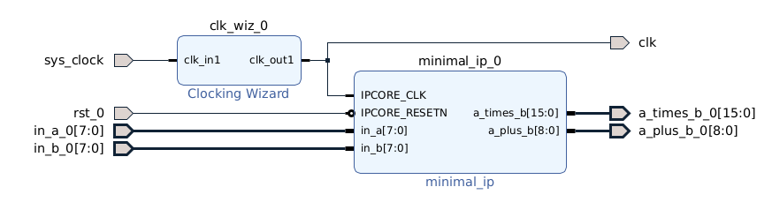
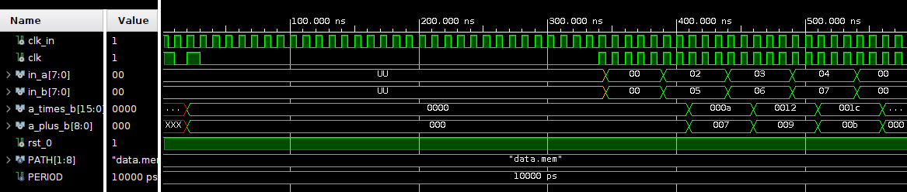

# Ip Core Debugging

En este ejemplo, vamos a generar un IP Core desde Simulink y crear un testbench en Vivado para poder probar su funcionamiento.

El IP Core generado tiene dos delays, trabaja a 100MHz, y devuelve la suma y multiplicación de dos valores.

Importante: la generación del IP Core se hace sin interfaz AXI4, desmarcar la opción en el Workflow advisor de Matlab.

Conectamos el IP Core en Vivado, como se muestra a continuación:

El resultado del testbench de vivado se condice con el esperado, multiplicación y suma luego de dos ciclos de clock, salvo en los primeros valores hasta que se propaga la entrada a la salida, momento en que la simulación devuelve "X" o "desconocido".

