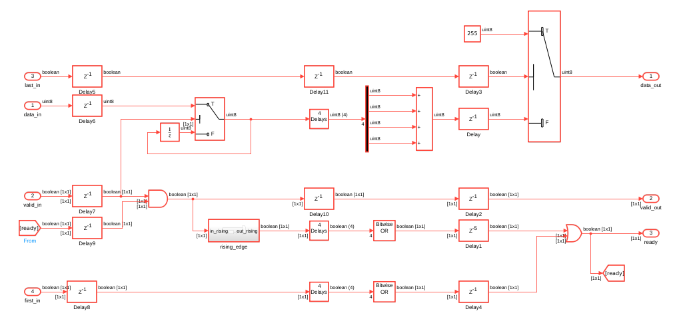
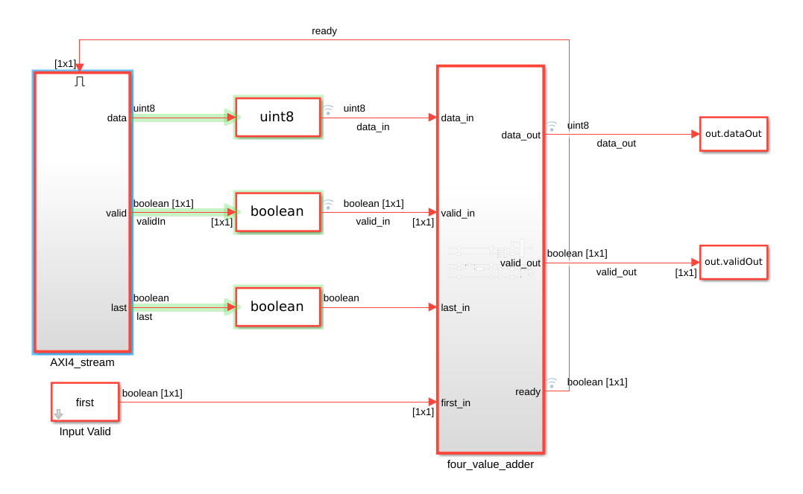
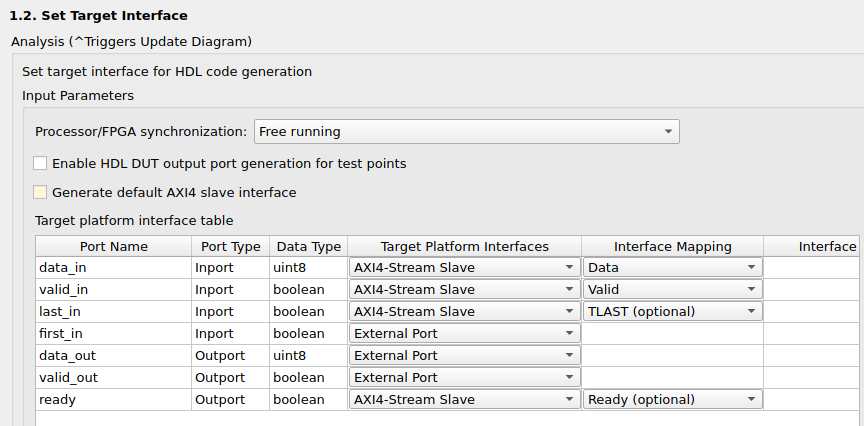
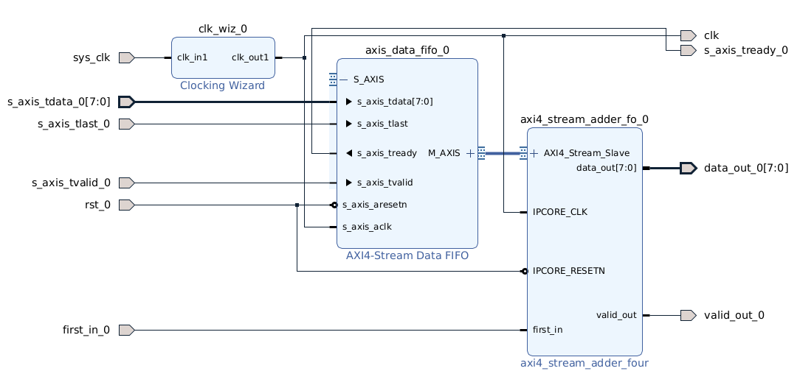
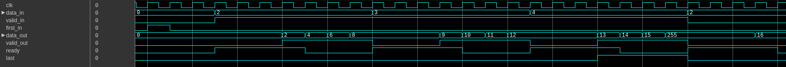
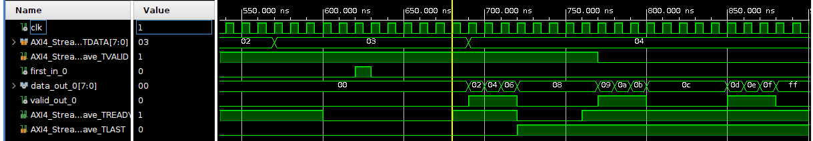

# AXI4 Stream Testbench

En este ejemplo, vamos a generar un IP Core con interfaz AXI4 Stream de entrada, y salida external port.

El diagrama de Simulink se muestra a continuación. Este IP Core tiene la función de sumar el valor de los últimos 4 valores que recibió a la entrada. La lógica de abajo genera una señal de "ready" que dura 4 ciclos de clock.

IMPORTANTE: para compatibilidad con AXI4-stream, es necesario que la señal "data_in" solamente cambie su valor dentro del bloque cuando "valid_in" es true. Notar la presencia del switch de retención en la línea de "data_in".

La interfaz AXI4-Stream se simula como un subsistema con "ready <= enable". Soporta las señales "TDATA", "TVALID" y "TLAST".

Al generar el IP Core, configuramos las señales para AXI4-Stream:

* TDATA
* TVALID
* TLAST
* TREADY

Para este test, el diagrama de Vivado va a tener instanciada una FIFO con AXI4-Stream. La idea es que, si nuestro bloque de Matlab se puede conectar con una FIFO, entonces es mucho más fácil después que cualquier otro bloque se pueda conectar con una FIFO, sin problemas de compatibilidad.

El testbench de Vivado va a usar dos archivos separados:

* El primero va a tener solamente los datos de entrada, los cuales van a ser cargados en la FIFO.

* El segundo va a tener solamente los datos de salida, los cuales van a ser comparados cuando la salida "valid_out" sea true.

A continuación, podemos ver la comparación de los diagramas temporales de Simulink y Vivado. Vemos que las señales no coinciden...

Sin embargo, el testbench funciona correctamente. El principal problema es que la señal "valid_out" tiene un ciclo menos de clock levantado a la salida que en Matlab.
