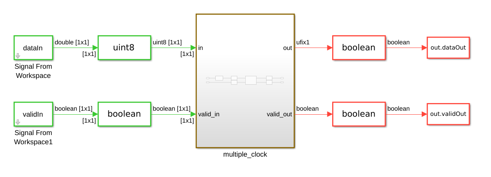
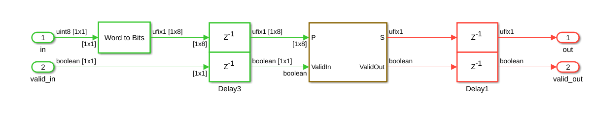
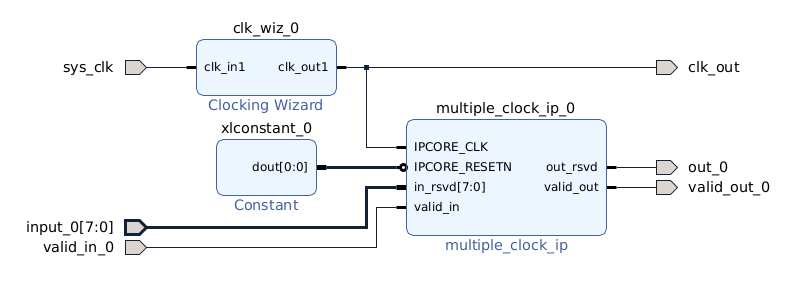
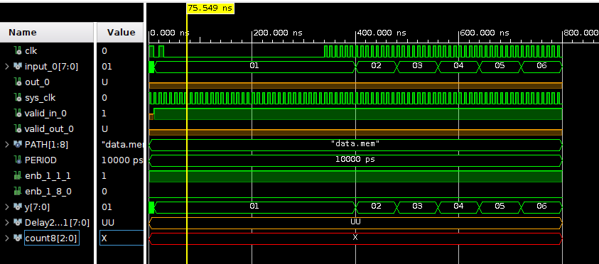
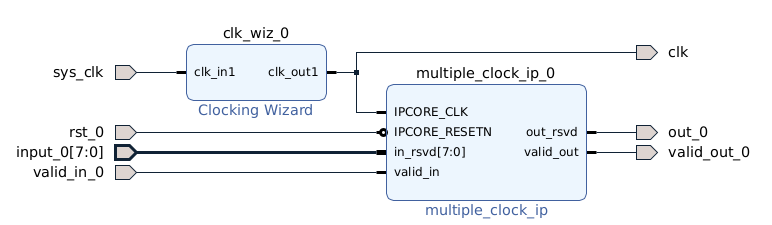
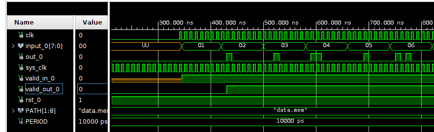
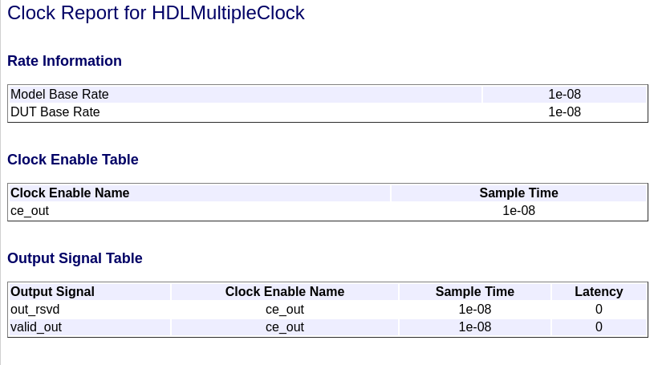
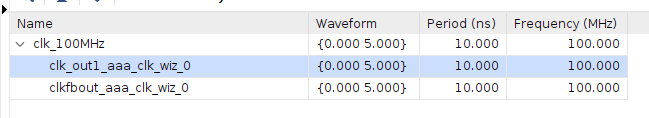

# Multiple clock

En este ejemplo vamos a generar un IP Core con múltiples clocks y simularlo en Vivado.

El modelo de Simulink es un bloque paralelo a serial de 8 bits





El Ip Core en Vivado fue generado con un target frequency = 100MHz.

En Vivado, el diseño es alimentado con un clock de 100 MHz.



Al querer correr la simulación, nos encontramos con un bug en el código VHDL. En la siguiente imagen, podemos ver que la señal "count8" es inválida.



Count8 es una señal que se usa para generar los distintos clocks. Analizando el IP Core creado, vemos que funciona de la siguiente manera:

* Todo el IP Core corre a la frecuencia de entrada, que debe ser la frecuencia más alta.

* En el archivo "<ip_core_name>_src_<ip_core_name>_tc.vhd", agarra la señal de clock, e instancia un contador que cuenta hasta 8 (en este caso, es la fracción del tiempo de muestreo).

```vhd
  -- Count limited, Unsigned Counter
  --  initial value   = 1
  --  step value      = 1
  --  count to value  = 7
  counter_8_process : PROCESS (clk)
  BEGIN
    IF clk'EVENT AND clk = '1' THEN
      IF reset_x = '1' THEN
        count8 <= to_unsigned(16#1#, 3);
      ELSIF clk_enable = '1' THEN
        count8 <= count8 + to_unsigned(16#1#, 3);
      END IF;
    END IF;
  END PROCESS counter_8_process;
```

* Cuando el contador alcanza "7" (su valor máximo), pone en "1" la señal `enb_1_8_0`. El IP Core maneja una señal de "enable" por cada clock, lo que hace que corra a distintas frecuencias de muestreo:

  * `enb_1_8_0`: Simula un sample_time de 1:8 (1 seg de entrada, 8 seg de salida). Habilita los flip-flops que corren a una velocidad más lenta cada 8 segundos.
  * `enb_1_1_1`: Simula un sample_time de 1:1 (habilita los flip-flops en todos los ciclos de clock).
  * `enb_x_y_z`: De forma genérica, habilita un clock con sample_time x:y, y es la señal de enable número "z" en ser instanciada.

Entonces, el bug lo podemos ver en que el código HDL que copie arriba. La señal "count8" en Vivado no tiene un valor inicial. El valor inicial solamente le es asignado cuando la señal de "reset_x" vale "1". Pero, en el diagrama en bloques conectamos una constante al valor de reset, de modo que nunca tomó un valor inicial, y por eso el valor es indefinido.

Por lo tanto, luego de hacer una pequeña rutina de reset antes de excitar la entrada, el resultado a la salida fue el esperado:

```vhd
 -- Reset system
rst_0 <= '0';
wait until rising_edge(clk);
rst_0 <= '1';
wait until rising_edge(clk); wait until rising_edge(clk);
```





Para generar el archivo de memoria para validar en Vivado:

* En Matlab, todos los datos son sampleados con la frecuencia más alta. Esto no significa que en el modelo utilizan frecuencias de sampleo iguales, sino que al cargarlos en el archivo, los valores más lentos se repiten "n" veces (por ejemplo, una señal de 12.5MHz se guarda repetida 8 veces por valor, para tener 100MHz).

* En Vivado, se compara 1 a 1 la salida de Simulink con la de Vivado, y tienen que ser exactamente iguales!

## Comparación de sintesís con un clock y múltiples clocks

Nos interesa interpretar el archivo de constraints y el timing del circuito para diferentes opciones. El problema que se viene teniendo es que el OFDM Modulator, que corre a un clock de 50MHz, no cumple el timing para 100MHz, pero no necesita tener esa reestricción de timing.

### IP AAA

Primero, vamos a usar:

* Target Frequency = 100MHZ.
* Clock input = Single.
* Treat Simulink rates as actual hardware rates = Off.
* Ninguna optimización.



En Vivado, el IP Core tiene solo una entrada de clock de 100MHz. En Vivado, a pesar que una parte del código corre a 100MHz y la otra a 12.5MHz, ambos clocks tienen la restricción de 100MHz para el timing.



### IP BBB

Ahora usamos:

* Target Frequency = 100MHz.
* Clock input = Single.
* Trat Simulink rates as actual hardware rates = On.
* Ninguna optimización.

No hubo ningún cambio respecto con AAA.

### IP CCC

Ahora usamos:

* Target Frequency = 100MHz.
* Clock input = Single.
* Trat Simulink rates as actual hardware rates = On.
* Optimización: enabled-based constraint

En la carpeta del IP Core se genera un archivo de constraints con el siguiente contenido:

```vhd
# Multicycle constraints for clock enable: multiple_clock_tc.u1_d8_o0
set enbregcell [get_cells -hier -filter {mcp_info=="multiple_clock_tc.u1_d8_o0"}]
set enbregnet [get_nets -of_objects [get_pins -of_objects $enbregcell -filter {DIRECTION == OUT}]]
set reglist1 [get_cells -of [filter [all_fanout -flat -endpoints_only $enbregnet] IS_ENABLE]]
set_multicycle_path 8 -setup -from $reglist1 -to $reglist1 -quiet
set_multicycle_path 7 -hold -from $reglist1 -to $reglist1 -quiet
```

A Vivado no le importa el agregado del archivo de constraints.

#### IP DDD

Ahora usamos:

* Target Frequency = 0MHz.
* Clock input = Single.
* Treat Simulink rates as actual hardware rates = On.
* Optimización: enabled-based constraint

Nada distinto desde Matlab. El IP Core generado tiene como entrada un clock de 100MHz.

### IP EEE

Ahora usamos:

* Target Frequency = 200MHz.
* Clock input = Multiple.
* Treat Simulink rates as actual hardware rates = Off.
* Enabled-based constraint = off.

HDL Coder no soporta "multiple clocks" como parámetro para la configuración de IP Cores.

## Usando el ejemplo de Matlab

Vamos a basarnos en [este ejemplo](https://la.mathworks.com/help/hdlcoder/ug/multicycle-path-constraints.html), y ver si podemos hacerlo funcionar tal cual la documentación.

Primero, generamos el IP Core con los siguientes parámetros:

* Target frequency = 130MHz.
* Clock Input = Single
* Treat Simulink rates as actual hardware rates = On.
* Enabled-based constraint = Off

Dado que la frecuencia a la que opera el bloque es de 2MHz, y la frecuencia objetivo es de 130MHz, Matlab determino que el oversampling factor de 65.


La síntesis en Vivado de este bloque es un desastre:

* El clock de entrada es de 100MHz, no 130MHz como se indicó en el modelo.
* El timing no cumple.


